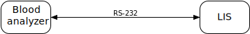
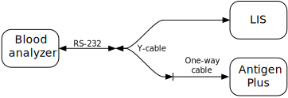
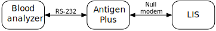
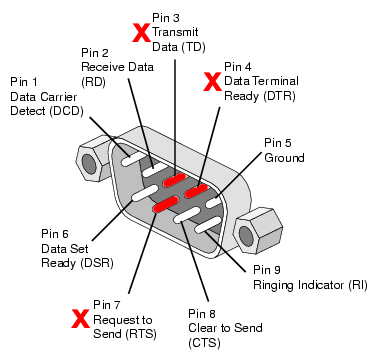
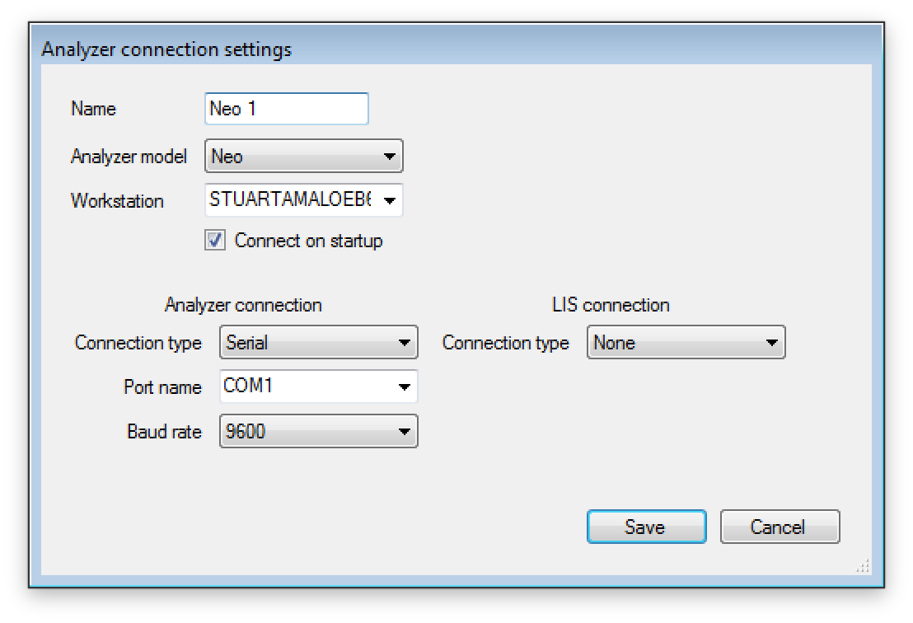
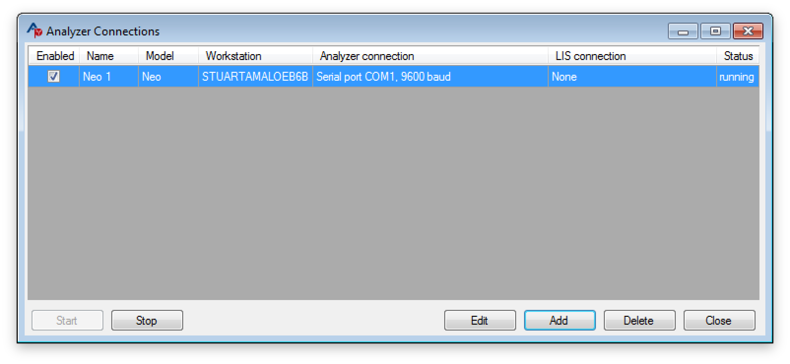
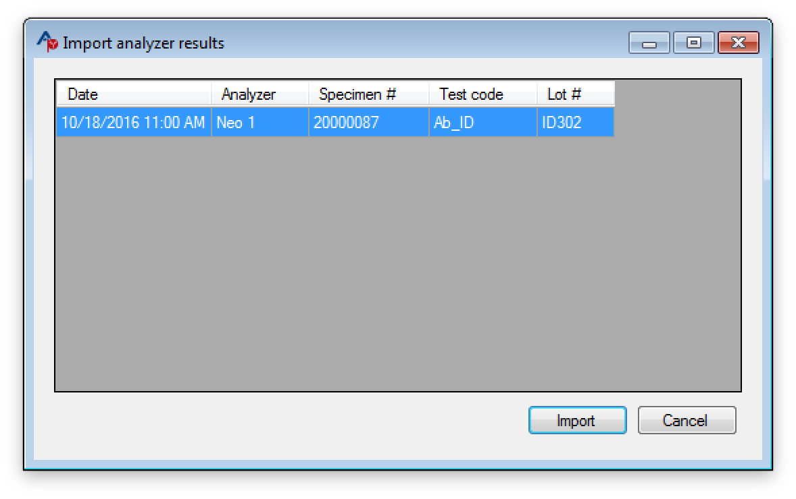
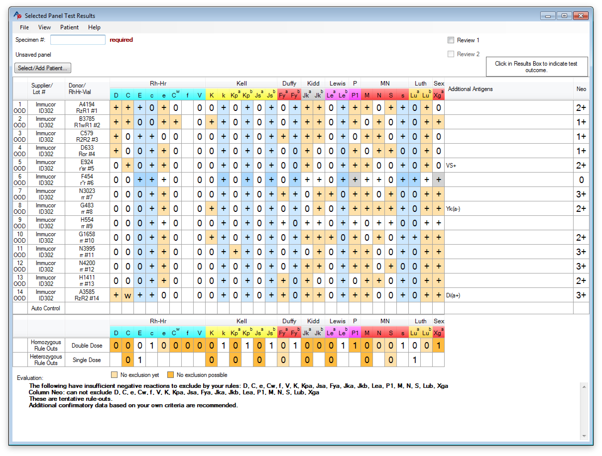

# Connecting Antigen Plus to a Blood Analyzer

## Overview

There are two parts to connecting Antigen Plus to a blood analyzer: physical
cabling and software configuration.

When Antigen Plus is connected to a blood analyzer, it continually monitors the
output of the analyzer for antigen screens. These results are stored in the
Antigen Plus database, where they can be pulled up from any workstation running
Antigen Plus for further analysis.

## Supported analyzers

Antigen Plus supports Neo analyzers from Immucor, Galileo & Echo analyzers from
Immucor, and Tango analyzers from BioRad.

Neo analyzers have the advantage that they transmit the Immucor lot number as
part of their results, so the process of creating an Antigen Plus panel is more
automatic. With other analyzers the technologist must manually select the lot
number used for testing.

Please contact Antigen Plus if you need support for a blood analyzer not listed.

## Cabling options

Most blood analyzers are connected to a laboratory’s LIS system with an RS-232
cable for placing of test orders and lookup of patient information.
Conceptually, this connection looks like this:

Antigen Plus eavesdrops on this communication in order to record blood antigen
testing results. The recommended way to achieve this is using a combination of
an RS-232 Y-cable and a RS-232 one-way cable:

This configuration allows Antigen Plus to monitor all output from the blood
analyzer, while the one-way cable ensures that Antigen Plus does not interfere
with communications between the blood analyzer and the LIS.

An alternative configuration is to use the pass-through feature of Antigen Plus
to retransmit information between the blood analyzer and the LIS. This requires
that Antigen Plus be running in order for the blood analyzer to communicate with
the LIS, but it does have the advantage that it does not require special
cabling:

Other configurations are possible. On a computer with sufficient serial ports,
it is possible to run Antigen Plus and the LIS on the same workstation. It is
also possible to run Antigen Plus and the LIS on the same workstation using
virtual serial port drivers. Please contact us if you have special needs.

## Physical Cabling

If you choose to cable Antigen Plus between the blood analyzer and the LIS, then
no special cabling is needed. The workstation running Antigen Plus will need 2
open serial ports. The existing serial cable from your blood analyzer can be
plugged into the Antigen Plus workstation, and a standard null-modem cable can
connect this workstation to the LIS. Note that in this configuration, Antigen
Plus must be running and properly configured for the blood analyzer to
communicate with the LIS.

The recommended configuration is to use a Y-cable combined with a one-way cable.
RS-232 Y-cables are readily available commercially. The most common
configuration would use a Y-cable with one male (pin) end and two female ends.
The male end would connect to the cable from the blood analyzer, and one of the
female ends would plug into the LIS.

The one-way cable is not readily available, but it is easy to construct. Simply
purchase a RS-232 extension cable and remove the pins from the male end that
would allow Antigen Plus to transmit data to the blood analyzer.

{: .important}

Do not attempt to use a Y-cable with your blood analyzer without also
constructing a one-way cable for the second connection! Even if the second
connection is not actively transmitting data, the presence of a second serial
port on the Y-cable can interfere with communications from the LIS to the blood
analyzer!

To construct a one-way cable, use needle-nose pliers or an RS-232 pin insertion
tool to break off pins 3, 4, and 7 from the male end of an RS-232 extension
cable.

## Software Configuration

Once physical cabling is complete, you should log into Antigen Plus using an
Antigen Plus administrator account and configure the blood analyzer by choosing
_Analyzer connections…_ from the _Options_ menu.

1. Click the _Add_ button to add a new analyzer connection.

   

2. Type a name for your analyzer into the _Name_ field. This can be any name you
   like to identify the analyzer.

3. Choose the model of analyzer.

4. Leave the _Workstation_ field alone. As long as you are creating the
   connection from the workstation where the analyzer is connected, this field
   should be filled in automatically.

5. Make sure the _Connect on startup_ box is checked.

6. Select the _Port name_ for the blood analyzer serial port.

7. Select the _Baud rate_ for your blood analyzer serial port connection. The
   baud rate should match the baud rate of your LIS system.

8. If you are using a Y-cable, then leave the LIS connection type set to _None_.
   If you are using pass-through cabling, then change this to _Serial_ and
   choose the Port name and Baud rate of your LIS system.

9. Click _Save_ to save the new connection settings. The new analyzer connection
   should be listed in the _Analyzer connections_ window and the Status should
   be _running_.

   

10. Close the _Analyzer connections_ window.

## Testing

To confirm that the blood analyzer connection is working correctly, perform an
antigen screening on the blood analyzer or re-transmit a previous antigen screen
from the blood analyzer to the LIS. Once this is done, choose _Import analyzer
results…_ from the _Panel_ menu in Antigen Plus. The test results should be
listed in the _Import analyzer results_ window.

If you have not already done so, download the lot information for the commercial
panel. Then import the analyzer results and compare them to the results printed
directly from the analyzer and the vendor’s printed worksheet. The imported
analyzer results should look something like this:

