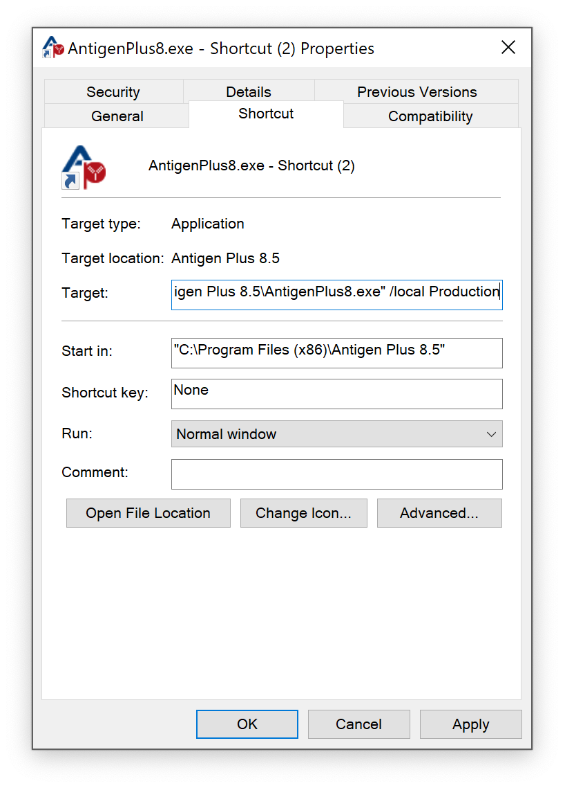

# Configuring databases

Antigen Plus supports both cloud databases managed my Antigen Plus, and local
databases managed by your local database administrator. You may use any
combination of cloud and local databases, up to the limit of your software
license.

By default, Antigen Plus connects to the cloud database named _default_. Users
may switch databases by choosing the _Select database..._ command from the
_File_ menu, or by choosing a
[customized shortcut](#creating-a-database-shortcut) when they launch Antigen
Plus.

Remember that the first user to connect to a given database will become the
Antigen Plus administrator for that database. You may want to ensure that the
laboratory manager is the first to connect to a new database.

## Cloud databases

Cloud databases are managed by Antigen Plus and stored in the Microsoft Azure US
East datacenter. These databases are managed by Microsoft to ensure high
availability.

Each registered copy of Antigen Plus starts with a cloud database named
_default_ that can immediately be used for evaluation and testing. To request
additional databases, contact
[customerservice@antigenplus.com](mailto:customerservice@antigenplus.com) and
let us know what you would like the new database to be named. We will let you
know when the new database is ready.

## Local databases

Creating a local database requires:

1. Creating an empty database in SQL Server
2. Editing the file `connections.config` to specify the connection string to
   that database

### Creating a local database

You may create a local database on any server running SQL Server 2008 or later.
The server instance can be shared with other databases, or dedicated to Antigen
Plus, at your preference. Remember that you are responsible for backups of local
databases.

The database can be created empty. All users of the database should have
_db_owner_ access to the database. We recommend creating an Active Directory
group for users of Antigen Plus, and then granting that group _db_owner_ access
to the database.

Antigen Plus will install the database schema when the first user connects to
the database. Since this takes several minutes and this user will become the
Antigen Plus administrator for that database, you should arrange for the
laboratory manager to be the first user to connect to a new database.

### Editing `connections.config`

Local databases are configured by editing the file `connections.config` in the
Antigen Plus installation folder, which is normally
`C:\Program Files (x86)\Antigen Plus 8.5`. This file is in XML format. The
default contents of this file are:

```xml
<?xml version="1.0" encoding="utf-8"?>
<connectionStrings>
  <clear />
  <!--
  <add name="Validation" connectionString="Data Source=OurSQLServer;Initial Catalog=AntigenPlusValidation;Integrated Security=True;Connect Timeout=30" providerName="System.Data.SqlClient" />
  <add name="Production" connectionString="Data Source=OurSQLServer;Initial Catalog=AntigenPlusProduction;Integrated Security=True;Connect Timeout=30" providerName="System.Data.SqlClient" />
  -->
</connectionStrings>
```

{: .warning}

The symbols `<!--` and `-->` are XML comment delimiters which prevent the sample
`<add` commands from being executed. When you edit the file to include your own
databases, your `<add` commands must be outside of these delimiters.

Note that there are three different names used in each connection string, and
each has a distinct purpose:

name

: The connection name that identifies the connection string to Antigen Plus.
This is the name you should use in your Antigen Plus shortcut.

Data Source

: The hostname of the SQL Server.

Initial Catalog

: The name of the database on the SQL Server.

The sample connection strings that we provide are configured to use Active
Directory for user authentication (`Integrated Security=True`), which is what we
recommend.

You can find additional details about connection strings in Microsoft's
documentation for
[SQLConnection.ConnectionString](https://docs.microsoft.com/en-us/dotnet/api/system.data.sqlclient.sqlconnection.connectionstring?view=dotnet-plat-ext-5.0).

## Creating a database shortcut

By default, Antigen Plus connects to a cloud database named _default_. If you
want users to connect directly to a different Antigen Plus database, then you
should create a custom application shortcut that specifies the name of the
connection string and whether the database is local or in the cloud.

To create a custom application shortcut:

1. Locate the application `AntigenPlus8.exe` in the installation directory,
   which is normally `C:\Program Files (x86)\Antigen Plus 8.5`.

2. Right-click on the application and choose _Copy_.

3. Right-click on the Desktop and choose _Paste shortcut_.

4. Right-click on the shortcut and choose _Properties_.

5. Move the text cursor to the end of the `Target` text field and append the
   text:

   /local _connectionname_

   or

   /cloud _connectionname_

   where _connectionname_ is the name you provided in your `connections.config`
   file (for a local database) or requested from Antigen Plus (for a cloud
   database). If the connection name contains a space, enclose the name in
   double-quotes. Make sure you leave a space between the double-quote at the
   end of the existing Target text and `/local` or `/cloud`. When you are done
   it should look like:

   

6. Click _OK_ to save your changes.

7. Rename the shortcut as desired.

8. Copy the shortcut to a location where it can be accessed by all Antigen Plus
   users.
