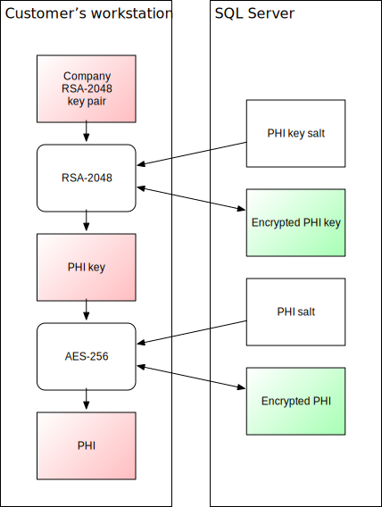

# Encryption and security

Antigen Plus uses multiple layers of encryption in order to protect patient
health information (PHI). These layers of encryption:

- Prevent server spoofing
- Prevent third-party evesdropping
- Prevent customer impersonation
- Protect data in motion
- Protect data at rest
- Prevent Antigen Plus staff from viewing PHI

## RSA public key encryption

The master key for both API calls to the Antigen Plus webserver and to patient
health information (PHI) stored in the database is the RSA-2048 company key that
is generated when you register Antigen Plus. Our servers only store the public
portion of the company key. The full public/private key pair is located in the
Windows system cryptographic store on each workstation, and in the
`.APCompanyKey` file that is saved when you register Antigen Plus.

Because the private company key never leaves your network, we have no access to
the PHI stored in your database, and no one can impersonate you to our
webserver.

## Transport Layer Security (TLS)

All communication between Antigen Plus and our servers is protected by TLS. This
prevents server spoofing, prevents third-party evesdropping, and protects data
in motion. TLS security is used for both connections to our API webserver and
our Azure SQL Server.

Our servers are currently configured to allow TLS versions 1.0, 1.1, and 1.2. If
your workstations support TLS 1.2, then all connections will be negotiated to
use TLS 1.2. If you require stronger assurances that older versions of TLS will
not be used, you can use a local SQL Server configured to your specifications,
or we can configure a private Azure SQL Server for an additional charge.

## JSON web tokens (JWT)

All API calls between Antigen Plus and our webserver are timestamped and
digitally signed with your RSA-2048 company key. Replies from our server are
similarly signed with our RSA-2048 key. This ensures that all API calls are
authentic and associated with the correct Antigen Plus customer.

## Transparent Data Encryption (TDE)

All databases hosted on our Azure SQL Server have
[transparent data encryption](https://docs.microsoft.com/en-us/azure/azure-sql/database/transparent-data-encryption-tde-overview?tabs=azure-portal)
enabled to protect data at rest. This encryption includes the database,
associated backups, and transaction log files.

## Advanced Encryption Standard (AES)

All patient health information (PHI) in the database is encrypted using AES-256
before the data ever leaves the workstation running Antigen Plus. This
encryption is in addition to the TLS and TDE encryption provided by Azure SQL
Server.

The AES-256 encryption key is generated randomly for each database and is itself
encrypted with your RSA-2048 private key. This ensures that only workstations in
possession of your company key can decrypt PHI in the database.

In addition, each patient record is salted with a unique random number to thwart
brute-force decryption attempts.

