# Menus

## File Menu

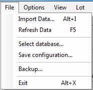

The File menu accesses five functions: Import Data, Refresh Data, Select
database, Save configuration, Backup, and Exit.

Import Data

: Allows the importation of commercial lots from the internet or
the importation of panels in Antigen Plus format from other sources.

    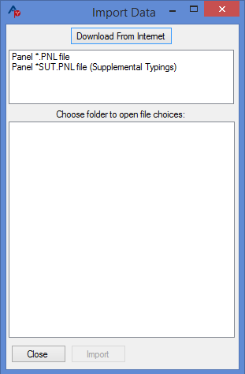

Refresh Data

: If you are doing a search and another user is downloading or
entering cell data at the same time, *Refresh Data* will ensure that the new
data are available to you for search.

Select database

: This option opens a screen that shows the available databases and allows you to
select one of them.

    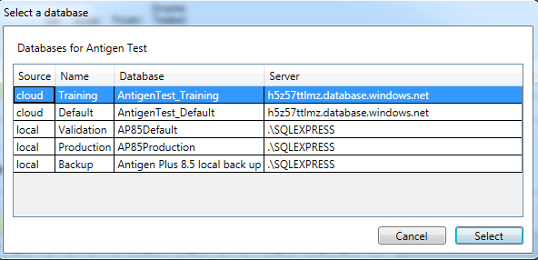

Save configuration

: Available to software administrators, this item on first
allows the saving of the configuration file for the software. On subsequent use,
it opens the folder containing the configuration files. Instructions can be
found in &quot;Antigen Plus 8.5 Installation and Configuration.&quot;

Backup

: Prompts you to select a location to back up all of your Antigen Plus
data. This feature was designed for a locally hosted database but is also useful
for maintaining a local fail-safe back up of the cloud hosted database for use
during an internet outage or in the highly unlikely case of a massive multiple
system failure both in our backup facilities and in Microsoft Azure.

: To avoid losing your data in the event of a pc or system failure, we recommend
that you store these data on a drive or storage device that is separate from
your system. The data may be easily retrieved by Antigen Plus using SQL Server
Management Studio. Instructions can be found in &quot;Antigen Plus 8.5
Installation and Configuration.&quot;

## Options Menu

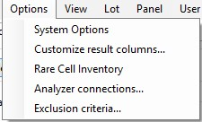

### System Options

The System Options menu allows you to set and/or change general default
parameters for using Antigen Plus in your lab. There are three tabs on this
menu—one each for General, Search, and Printing options.

#### General Tab

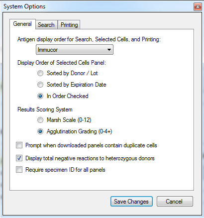

Antigen Display Order for Search, Selected Cells, and Printing

: Sets the display order for cells on each screen where the antigen array appears. The
antigen array of whichever manufacturer (or alternative) is selected will be the
one you use for searching, selecting, and entering your test results.

    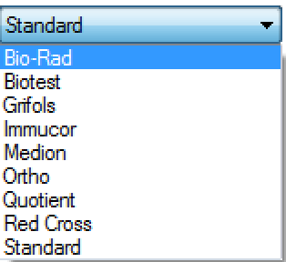

Display Order of Selected Cells Panel

: Allows you to view your selected
cells in one of three sorted orders in Selected Cells panels and Results
Worksheets.

Results Scoring System

: Allows you to select one of two scoring systems for
entering your test results in the **Results Worksheet**.

Prompt When Downloaded Panels Contain Duplicate Cells

: Activates an
automatic check for duplicate cells when you are downloading commercial red cell
panels. If you chose this option, when you download a panel, you will be alerted
to the existence of duplicate donor cells in your database and be given the
option to ignore them, mark them out-of-stock, or delete them (as long as they
are not in any worksheet that you have saved).

    **Please note**: If you are importing two identical panels (e.g. Quotient panels
    that are the same except that one is enzyme treated), both panels will be marked
    out-of-stock if you have this feature turned on and choose the out-of-stock
    option.

    

Display total negative reactions to heterozygous donors

: This option adds a
rule-out count row to the Worksheet to show reactions that that may provide more
evidence toward an exclusion when the required homozygous cells are not
available for testing.

Require Specimen ID for All Panels

: Makes it a requirement to add a
Specimen ID number to any saved panel. When this is selected, you may not save
any work-up without entering a specimen ID number. Only administrators may set
this option. For more information about adding specimen ID numbers, see page
34??.

#### Search Tab

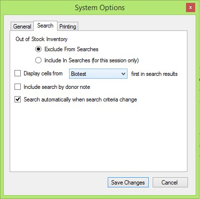

Out of Stock Inventory

: Allows you to include out-of-stock cells in your
searches.

Display Cells from _Supplier_ First in Search Results

: Allows you
to prioritize your search by a single supplier. Normally, when cells are
searched, the search order is freshest to oldest to frozen. This option allows
you to find all the cells from one supplier in that order before other cells are
found. This feature is designed to make cell selection easier for those labs
that rely most heavily on a single supplier or test system and would prefer to
test those cells unless none are available with the required characteristics.

Include Search by Donor Note

: Activates the search by donor note function
on the Search screen. The text box on the screen will search donors by whatever
text is in an associated note. This is primarily useful for reference labs with
frozen inventories of rare cells and cells they have typed and frozen
themselves.

Search Automatically When Search Criteria Change

: Removes the Search button
from the **Search Cells** screen. When this is done, cells matching each
criterion entered are found and displayed. As more criteria are added, the cells
change to match the cumulative pattern. Hospitals and blood banks with an
inventory of fewer than 200 cells may find it more convenient to search in this
manner as it eliminates the necessity of hitting the search button to initiate a
search.

#### Printing Tab

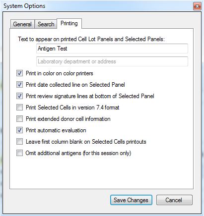

Text to Appear on Printed Cell Lot Panels and Selected Panels

: Allows you
to enter text that will be printed on any printed output to identify your
facility. There are no limits to the amount of text you can enter, but filling
more than the space available will result in overprinting issues.

Print Review Signature Lines at Bottom of Selected Panel

: Allows you to
print signature review lines on the bottom of the printed Selected Cells Panel
if you are doing manual rule-outs.

Print Selected Cells in Version 7.4 Format

: Allows the **Selected Cells
Panel** to print in the format used in Version 7.4. This is to satisfy SOP
requirements of reference labs that have been accustomed to this format.

Print Extended Donor Cell Information

: Enables the printing of extended
information about each donor cell on panel at the end of a selected panel or
worksheet.

Print Automated Evaluation

: This feature is checked as the default for the software. Unchecking it allows
the printing of the worksheet without the evaluation for those who wish to do
the evaluation manually using the worksheet layout.

Leave First Column Blank on Selected Cells Printouts

: Eliminates the text in
the first column of a printed Selected Cells Panel –the selection order number
and any out of date or frozen designation will appear on the screen but not on
the printout to allow space for manual notes.

### Customize Results Columns

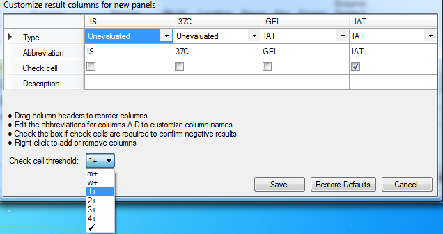

In the **Customize Results Columns** screen, administrators may customize the
results columns that will appear in Results Worksheets for all users. The
default results columns are IAT, ENZ, DTT, A, B, C, and D respectively. By
default, A, B, C, and D exclude by the same rules as IAT.

From here, columns may be added, renamed, repositioned, removed, or set to
exclude by different rules. Right-clicking on a column will give you the option
to Add Column or Remove Column. Editing the Abbreviation text will change the
name of the column. By dragging a column with the mouse, it can be repositioned.
The dropdown menu in the Type row allows you to assign each column to exclude by
IAT, Enzymes, DTT, or by Adsorption rules (see page??), or the Unevaluated
column can display results that are not evaluated on the worksheet. The
description field will display any text you enter to identify the column or
testing method on your worksheet.

Finally, selecting or de-selecting the Check Cell box will add or remove a check
cell requirement to each result in that column. The check cell threshold may
then be set by using the Check Cell Threshold dropdown menu at the bottom of the
screen. If you select the check mark at the bottom, your check cell results will
either be a check for postitive, or an &quot;x&#39; for negative.

To restore the default arrangement of results columns, simply select **Restore
Defaults**. Please note that when adding, removing, or editing results columns,
the Results Worksheet will not reflect your changes until it is cleared and a
new one is started.

Please note that Customize Results Columns will set the default columns that
will appear anytime a user opens a Results Worksheet _unless_ the user is
importing results from a blood analyzer machine. In this case only the blood
analyzer result column will appear, and other columns may be added manually.

### Rare Cell Inventory

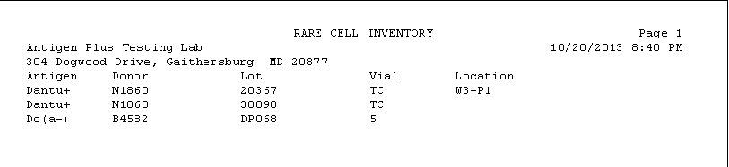

This option calls up a list of all the special typings (additional antigens) in
your database. You may search for all or some of them and print out a report.

Since BioTest has added Coltons and Diegos to their standard array and Quotient
has added Wra, these additional antigens will not appear on the rare cell
inventory list but can be enumerated by searching for them on the Search screen.

### Analyzer Connections

This option allows you to view and manage your blood analyzer machine
connections. For more information on analyzer connections, see page 38.

### Exclusion Criteria

The default exclusion criteria in Antigen Plus are taken from the AABB Technical
Manual. In many cases, laboratories may wish to set stricter criteria to
determine exclusion by their own standards. Therefore, each lab can establish an
acceptable number of rule-outs for the exclusion of specific antigens. Only
administrators may set the exclusion criteria.

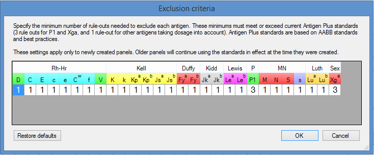

In the **Exclusion Criteria** menu, you may specify the minimum number of
rule-outs needed to exclude each antigen. The criteria are entered by selecting
the box and typing the number with the keyboard.

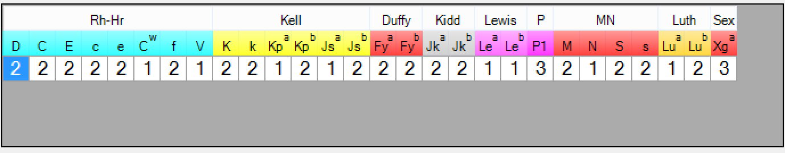
_This picture is one example of custom exclusion criteria that a user may set._

These minimums must meet or exceed current Antigen Plus standards, which are
based on AABB standards and best practices. These settings will apply only to
newly created panels. Older panels will continue using the standards in effect
at the time they were created. If you load a results worksheet that was saved
before changes were made to your exclusion criteria, a warning will appear at
the top of the screen.

To restore your exclusion criteria back to the default AABB standards, select
**Restore Defaults.**

## View Menu

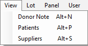

### Donor Note

When a donor is selected on the Search screen or Add/Edit screen, the donor note
option allows a note to be inserted that will stay with that donor number
(regardless of lot number) until it is removed.

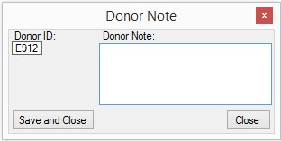

The donor note will be displayed with the cell on the Add/Edit or Search
screens.

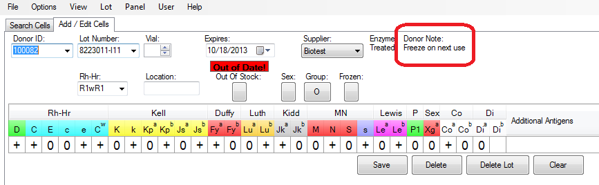

### Patients

The Patients menu opens the **Maintain Patients** screen where patient
information may be viewed and edited.

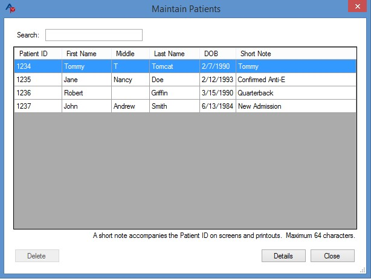

The search feature on this screen enables a search by any of the criteria in any
of the columns. Double clicking on a patient will bring up the **Patient
Details** screen. From there you can select Edit to change patient details and
phenotype. When editing patient information, you must enter a reason for the
edit. This will be saved along with the user that made the change and the date
and time of the edit.

For more on working with patient information in Antigen Plus, see _Patient
Information_ on page 30??.

### Suppliers

This option allows entry of a supplier other than the currently licensed
commercial red cell manufacturers. This is primarily for reference laboratories
who are typing their own cells or receiving cells from other sources. Any of the
available antigen arrays may be associated with the new supplier.

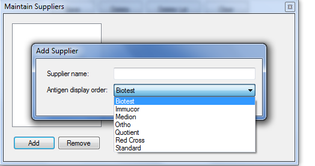

## Lot Menu

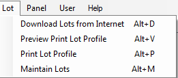

The Lot menu connects you with the Antigen Plus server for download of
commercial red cell panels (see Downloading Lots on page 19), and allows for
preview or printing of any lot that is selected on the **Add/Edit** or
**Search** screens.

Selecting **Maintain Lots** opens the Maintain Lots table. On this table you can
delete one or more lots (as long as they have not been used in any saved work in
the last ten years) by highlighting a row (or highlighting several rows by
holding down the CTRL key), clicking on Delete Selected Lots, and then clicking
Save Changes. You may also mark any lot as out-of-stock or enzyme treated. A lot
that is in-stock but has one or more cells that are out-of-stock will be marked
with a square rather than a check mark in the box. Lots can be sorted in
forwards or backwards Lot Number or Expiration Date order by clicking at the top
of the column.

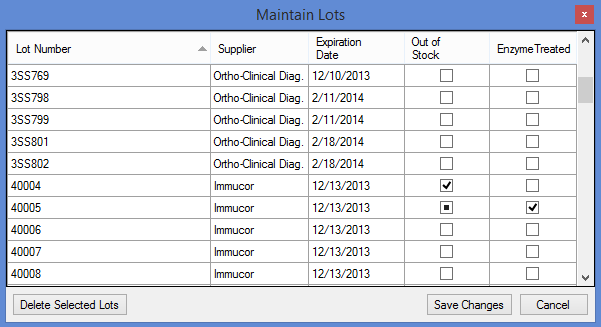

If you attempt to delete a lot that has been used in a saved workup, you will be
notified that the saved work must be deleted before the lot can be deleted.
Deletion of saved work-ups may only be done after ten years have passed since
the panel was saved. If it is too early or you do not wish to delete the work
and the lot, you may mark the lot as out-of-stock thus removing it from
searchable inventory while saving any work that has been done with it.

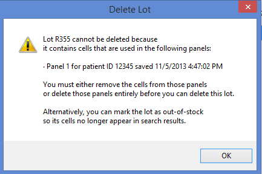

## Panel Menu

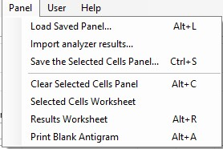

The Panel Menu brings up a variety of options that are the most frequently used
in Antigen Plus.

If those options are unavailable (i.e. there are no cells selected), they will
be greyed out on the screen.

### Load Saved Panel

This option opens up a table of all saved work-ups (any selected panel that has
been saved with or without test results).

A saved panel may be retrieved for further work or review by selecting its row
and pressing **Load** or by double-clicking on the row. Once the saved panel is
retrieved, all of the information it was saved with will populate the
appropriate screens ( **Search** , **Selected Cells Worksheet** , and **Results
Worksheet** ).

A saved panel may also be deleted from this table if it is ten years old—a
confirmatory warning will appear after Delete is selected.

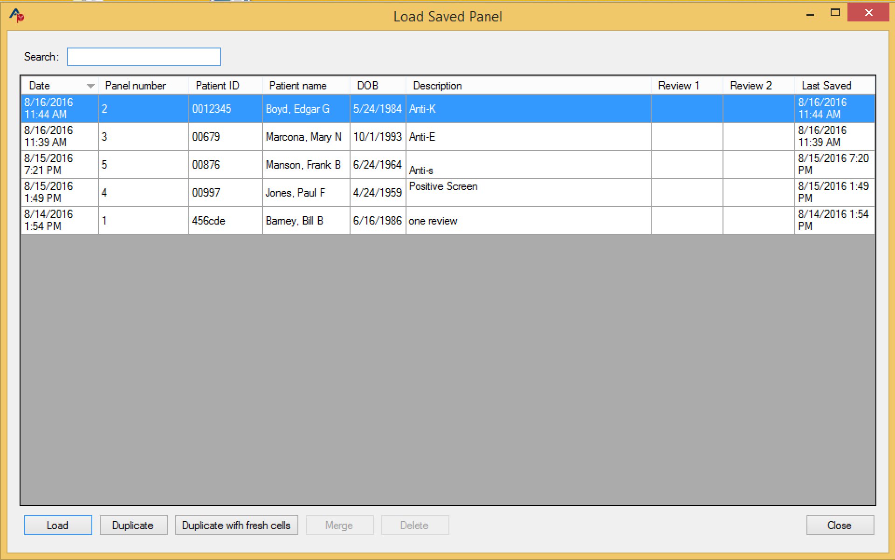

**Duplicate** creates an exact copy of whichever saved panel is currently
selected. That panel may then be saved as a new panel.

**Duplicate with Fresh Cells** also makes a copy of the saved panel but will
also automatically swap out any out-of-date or out-of-stock cells with fresh
cells in your inventory that have antigen profiles that are as close as possible
to the original.

#### Merging panels

Two or more panels can be merged in a work-up for a single patient. The primary
use of this feature is to be able to merge a screen and a full panel that are
run separately in the analyzer, but any set of results for a patient can be
merged into one worksheet—all details of the patient must match including
specimen number if it was used. All columns that were used in the original
panels will appear.

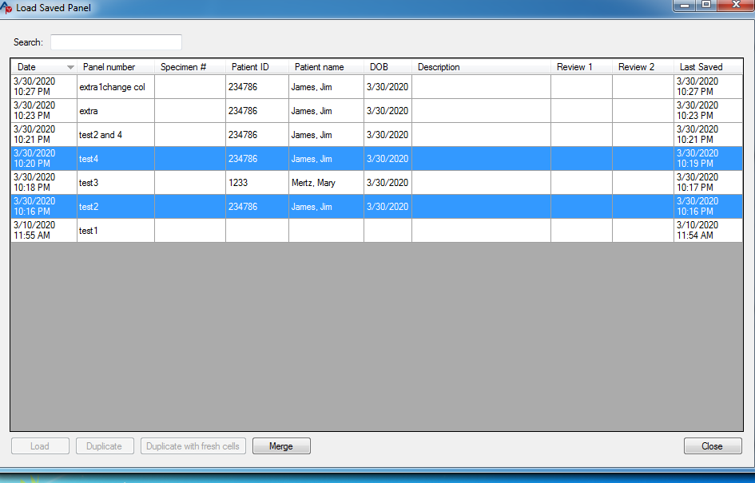

### Import Analyzer Results

This menu allows the importing of results from a blood analyzer machine. For
more information about importing blood analyzer results, see page 39.

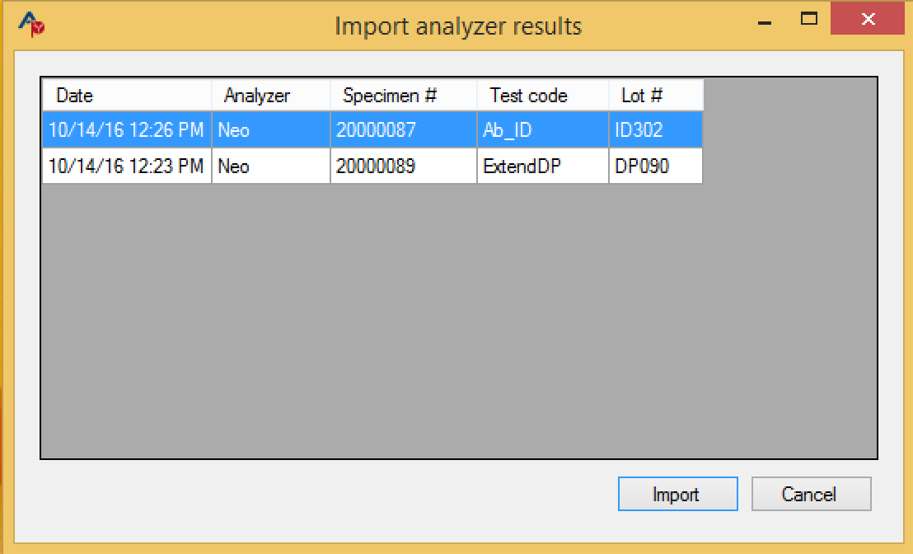

### Save the Selected Cells Panel

You may save a Selected Panel (with any results included) from this screen. As
this can be done more directly from the Selected Cells Worksheet or Results
Worksheet, the function is here so that you may remember to save current work
when you are loading another panel (there will also be a warning when you are
loading a new panel that one is already in use).

### Clear Selected Cells Panel

Selecting **Clear Selected Cells Panel** will clear all of the currently
selected cells. You will be prompted to either save or discard your current
work.

### Selected Cells Worksheet and Results Worksheet

Selecting Selected Cells Worksheet or Results Worksheet will call up the current
work and open those screens. For more information about Selected Cells and
Results Worksheets, see Operation on page 19.

### Print Blank Antigram

Prints a blank worksheet.

## User Menu

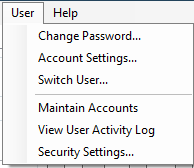

### Change Password

Any user can change his or her password. That change can be overridden by an
administrator changing that user&#39;s password.

### Account Settings

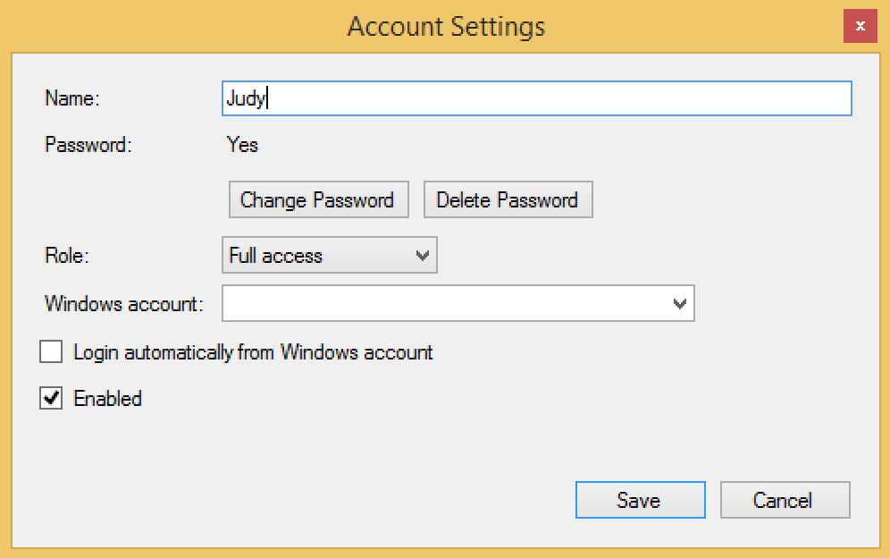

This window allows a user to change their name and password. Administrators may
also assign administration rights from this window and enable or disable
accounts. A new user may not log in until an administrator has added him or her
in the **Maintain Accounts** table or Windows Active directory is used to
authenticate new users (see Authenticating Users on page?? )

### Switch User

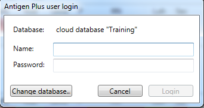

Logs the current user out and asks for a username and password to continue. A
new database may also be selected from this screen.

### Maintain Accounts

This menu is available only to administrators and is used for managing user
access to Antigen Plus. If **Automatically create accounts from Windows Login**
is checked, Antigen Plus will recognize the user from that user&#39;s log in to
Windows and require a password if the Windows login also requires it. Selecting
Add will call up a fresh Account Settings screen and allow the administrator to
create a new account. Selecting Delete will delete an account if that user has
not saved any work. To remove a user who has saved work in the database, he or
she must be disabled. In order to deactivate and account but keep that user
displayed on saved work-ups, simply uncheck the Enabled box in the Account
Settings window.

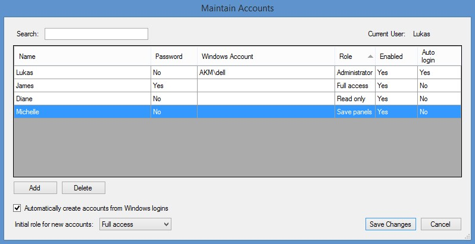

Double-clicking on any user will call up the **Account Settings** screen for
that user. Here, an administrator may set access privileges and password
preferences. If the user is not set to automatically log-in with their windows
account, they must be given a password in order to log-in.

The possible roles an Administrator can grant another user are:

Administrator

: Can maintain users, can save panels, can review panels tested
by self or another technologist, can remove reviews, can add suppliers, can edit
cells, and can edit all patient information. Administrators may also set system
options including custom exclusion criteria, whether or not to require specimen
numbers, and customize the default results columns.

Full access

: Can save panels, can review panels tested by another
technologist, can add suppliers, and can edit cells. Full access users cannot
edit patient information, but they may add phenotypes to patients.

Save panels

: Can search, select, enter results and save panels.

Read only

: Can search, select, and enter results but cannot save any work.

Each user may change his or her own password.

### View User Activity Log

An administrator will have this feature enabled and selecting it will call up a
log of all user log-ins and all activity involving patient information. This log
is exportable in a csv format.

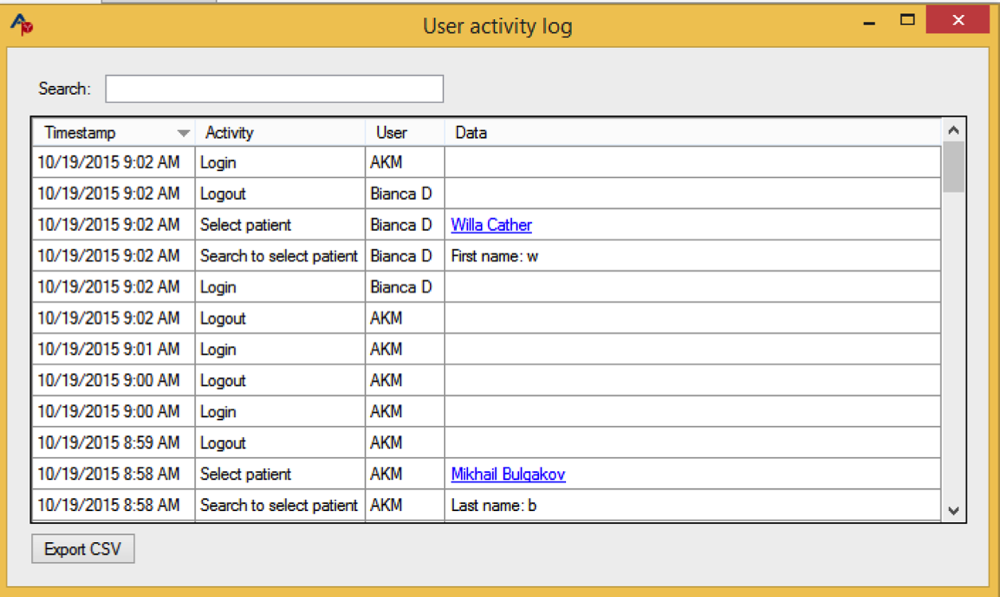

### Security Settings for Time Outs and Username/Password Mode

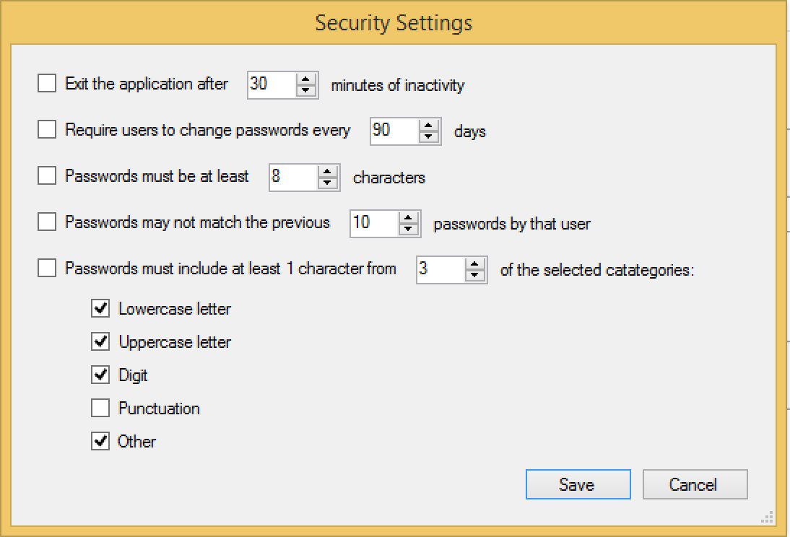

**Timing out** : If you would like to have the program shut down if left
unattended, check the box next to &quot;Exit the Application…&quot; and set your
time parameter. If a user leaves the program unattended for that length of time,
the program will shut down and the work in progress will reappear only when that
user logs back in. This option is available for both automated and manual
password access.

The other options are for manual password configurations and are activated by
checking the boxes on the left of the options and setting the desired parameters
to the right.

## Help Menu

The Help Menu makes text regarding the use of Antigen Plus available to the
user. That text is reproduced in this manual in the appropriately named
sections.
