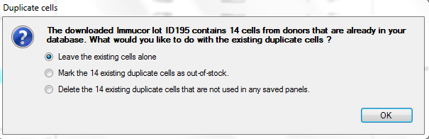

# Operation

## Downloading Lots from the Internet

When you press _Download Lots from Internet_ from the Lot menu, you will see the
following screen:

Available panels are listed in descending order of Expiration Date. They may
also be sorted in ascending order or by Supplier or Lot Number by clicking on
the column title. You may select as many as you wish, the number selected is
displayed at the bottom of the screen as each panel is added to your database
when you click Download Selected Lot(s).

### Downloading Lots with Supplemental Typings

Immucor provides supplemental unconfirmed typings with some of their panels. You
may download some or all of these by selecting the SUT box next to the lot
number when you are downloading. You will be given a choice of which typings you
wish to see on your downloaded cells in a dialog box. Your choices will remain
and may be changed or not the next time you download.

While the main panel data are verified electronically and do not require
physical validation (with the current exception of Medion), the supplemental
typings should be checked by donor to ensure that they have all been captured.
Manual entry of any missing ones can be done by pulling up the donor on the
Add/Edit screen.

### Download Prompt Option

If you have selected _Prompt when downloading duplicate cells_ in the **System
Options** menu, you will be notified whenever donors on the downloading panel
exist in your database. You can ignore the notification, mark the duplicate
cells as out of stock, or delete them. If you attempt to delete a cell that has
been stored as part of a saved panel, you will be advised to mark it out of
stock instead.

**Please note:** If you are importing two identical panels (e.g. Quotient panels
that are the same except that one is enzyme treated), both panels will be marked
out-of-stock if you have this feature turned on and chose the out-of-stock
option.

## Searching and Selecting Cells

### Search Pattern

When the program starts, the **Search** **screen** will automatically be
displayed. A search pattern box allows you to enter a search pattern of the 28
principal antigens and/or any additional antigens, search the inventory for
matches, and mark cells or lots for inclusion in a **Selected Cells Panel** or a
**Results Worksheet**. (Some red cell suppliers include additional antigens on
their array and some leave off principal antigens; those arrays are displayed
that way in Antigen Plus if that supplier is chosen. See **Antigen Order for
Selected Cells** on page 25.)

As you search your database, you will notice color-coding that will highlight
the search boxes change as you select and de-select cells. For an explanation of
the color-coding function, see page 36.

If _search automatically when search criteria change_ is selected in the
**Search** tab in the **System Options** menu, the search panel will immediately
display how many cells are found in your database that are matches for your
current search pattern. If this option is not selected, you must enter your
search criteria and click **Search** to display the matching cells from your
database. In either case, the number of matches that your current search has
found will display at the bottom of the screen. The number of cells currently
selected will also display at the bottom of the screen and will update each time
you select or deselect a cell.

To enter a search pattern, click the desired antigen buttons in the search
pattern box. You may set the buttons to 0, +, or blank. A 0 or + setting means
that a matching cell must have a 0 or + in the same place (s or w designations
will be read as + during a search). A blank setting means "don't care", and
during a search those antigens will be ignored.

You may also search by the following criteria: **Donor ID,\*\*** Lot Number
**,** Sex **,** Group **,** Frozen **cells, and** Enzyme Treated\*\* cells.
Please note that if you are currently searching by a particular lot, your
searches will only include cells from that lot until you have cleared that lot
from your search criteria.

When you search, the inventory will be searched starting with the newest cells
first, that is, in reverse expiration date order. All frozen cells have no
expiration date and will be gathered at the end of the search order unless you
have specified a preferred supplier in **System Options** in which case all
cells from that supplier will be found first in reverse expiration order and be
followed by all other suppliers in reverse expiration order. Clicking on a cell
in your search results will highlight it in light blue and information about
that cell will display above your search results. Please note that Out-of-Stock
cells will not be displayed in your search if _Exclude from Searches_ is
selected in **System Options**.

To clear your current search criteria and start a new search, select **Clear
Search Criteria**.

To add additional antigens to the search pattern, check those desired in the
Additional Antigens box by selecting the arrow on the right of the box to drop
down a list of all the additional antigens in your database. You may select as
many additional antigens as you like, but only the first 8 to 10 (depending upon
their length) will display on the screen and an ellipsis will indicate that more
are selected. If you mouse over any of the selected antigens or the ellipsis, a
box containing all of your selected antigens and their associated ISBT
designations will appear.

A table of ISBT designations used in Antigen Plus can be found in the Appendix.
To remove Additional **Antigens** from the search display box, uncheck the
item(s) in the Additional Antigens drop down list.

### Selecting and Deselecting

To select a cell, check the **Select** box to the right of each cell. To select
all cells in your current search, click **Select ALL Matches**. Cells that are
selected with a check mark are automatically included on Selected Cell and
Results Worksheet panels, which can be called up by choosing the appropriate
option in the Panel menu or by selecting **View Selected Cells** or Open
Worksheet at the bottom of your search screen. When duplicate cells are
selected, they will be highlighted in yellow so that they may be easily
de-selected.

Your currently selected cells will remain selected until you uncheck the
**Select** box next to each cell or until you click **Clear All Selected
Cells**. If you choose to clear all selected cells and you have not saved your
current work, a warning box will appear asking if you would like to either
**Save** or **Discard** your current selected cells panel.

### Selecting Expired Cells

Whenever you select a cell (or cells) with an expiration date that has passed, a
dialog box will appear allowing you to select that cell (or cells) to enter the
results of testing to ensure that cell is still reactive for the specific
antigens in question. You may enter the result for any or all of the positive
antigens on that cell and those results will be maintained with the date of the
test and the name of the tester. You may opt out of this process by selecting
**Close** and the cell will still be selected.

## Antigen Order for Selected Cells

The antigen buttons are displayed in a standard default order of blood groups:
Rh-Hr, Kell, Duffy, Kidd, Lewis, P, MN, Lutheran, and Sex-Linked. Some
suppliers' data sheets list them in a different order, so in order to simplify
searching, selecting, and entering data there are 9 display options selectable
with the 9 option buttons in the **System Options** menu. These choices stay
with any donor displayed in the Search mode (if more than one supplier is
represented, the Additional Antigens box will accommodate any typings missing
from an array; e.g. if you are using the Immucor order that omits the "f" typing
and select an additional cell that has this typing, the "f-" or "f+" will appear
in the Additional Antigens box (exclusion rules will consider the 28 common
typings regardless of where they appear on the screen).

Please note: If the manufacturer does not provide the "f" typing, Antigen Plus
will make no assumptions and will not rule it out. For more information, see
page 50.

### Available Arrays

Option 1: BioTest

Option 2: Immucor

Option 3: Medion/Grifols

Option 4: Ortho

Option 5: Quotient

Option 6: Red Cross Preferred

Option 7: Standard (Johns Hopkins) Option

Option 8: Bio-Rad

Option 9: Grifols

## Selected Cells Panels

Your panel of currently selected cells can be called up and reviewed by either
clicking **Preview Selected Cells** at the bottom of the Search screen, or by
going to the Panel menu and choosing **Selected Cells Worksheet.** Either option
will cause your Selected Panel will appear in a separate window.

On the Selected Panel screen, you may review all of your currently selected
cells and deselect any cell by unchecking the **Selected** box to the right of
each cell.

You may also assign the Selected Panel to a particular patient by choosing
**Select/Add Patient.** For more about entering patients and patient
information, see page 30.

Your currently selected cells may also be called up in a Results Worksheetby by
either clicking Open Worksheet at the bottom of the Search screen, or going to
the Panel menu and choosing **Results Worksheet**. In the Results Worksheet, you
may enter and evaluate your test results. For more information about entering
and evaluating test results, see page 33.

On any Selected Cells panel or Results Worksheet, the cells will be sorted
according to your preferences in **System Options**.

## Saving and Loading Panels

To save a panel, go to the File menu on a Selected Cells panel or Results
Worksheet and choose **Save Panel**. When saving a panel, you must set a panel
number. You may then add a Patient, add Conclusion Antibodies and Conclusion
Notes, and add a Full Panel Description. In the panel description, you may enter
as much text as you like and it will be saved along with the panel. Please note:
you may save a Selected Cells panel or a Results Worksheet without a patient as
long as no results are entered. Once results are entered on a Results Worksheet,
you must add a patient in order to save the work-up.

## Printing Panels

The Selected Panel Worksheet may be printed at any time by selecting File/ Print
at the top left of the screen. If there are more additional antigens than can
print on one line, more lines will be inserted underneath the cell until all
additional antigens are printed. The worksheet will display the date and time it
was printed. If a patient has been selected with the Selected Panel, the patient
information will display on the print-out. The Selected Panel Worksheet prints
out with eight blank columns on the right for manually entering test results and
additional blank rows beneath the last selected cell to the end of the page.

**Print Blank Antigram:**

Prints a completely blank panel, just like above but with the supplier, donor,
and antigen columns left unpopulated. It will have blank spaces at the top for
writing patient name, patient ID, conclusion, technologist, date collected, and
date tested.

## Patient Information

Information about patients that will display on the Search screen and remain
with saved work-ups is entered on the Search screen by selecting **Select/Add
Patient.** On the Search screen, click on the Select/Add Patient button and
search for a patient to modify, or fill in a new ID, name, and optional date of
birth and short note and press **Add**.

You must enter an ID for the patient that will uniquely identify that patient.
The nomenclature or protocol is up to you. When a patient is selected, their ID
and their first and last names will appear at the top of the Search screen as
well as the Selected Cells panel and the Results Worksheet. Saving any work-up
with a particular patient selected will attach that patient to the printed
worksheet as well as the saved lot table.

When a Patient is selected and displayed at the top of the screen, you may
right-click on the patient to either **Change Patient** , **View Patient
Details** , or **Update Patient Information**. **Change Patient** will take you
to the **Select/Add Patient** screen and allow you to switch to a different
patient. **View Patient Details** will bring you to their patient details screen
where you can edit that patient's information and view the editing history for
that patient.

You may also call up a list of your patients by selecting **Patients** from the
**View** menu. Double-clicking on a patient or highlighting a patient and
clicking Details will call up the **Patient Details** screen for that patient
where their information may be added or edited. Only administrators may edit
patient details.

The following information may be stored with each patient:

- **ID** (required)
- **Last name** (required)
- **First name** (required)
- **Middle Name**
- **Date of Birth**
- **Short Note**
- **Phenotype**: A patient's phenotype will populate the Auto Control row at the
  bottom of the selected cells in the Results Worksheet whenever a patient is
  assigned to the worksheet.
- **Conclusion Antibodies and Conclusion Notes** : See page 38.
- **Specimen Number** : When adding a new patient, there is a space to add the
  specimen number that will be associated with that patient's current workup.
  The specimen number will saved with the panel rather than with the patient.
  For more on specimen numbers, see page 33.

Each time you edit a patient's information in their Patient Details screen, you
must enter a reason for the edits. All previous edits to that patient will be
displayed on the Patient Details screen under Editing History. Each saved panel
that the patient is attached to will also display under Editing History. You may
double click on a saved panel to load it, or you may select a saved panel and
choose to Duplicate or Duplicate with Fresh Cells.

**Update Patient Information:** If you load a saved panel with a patient whose
information has been changed, it will be marked Obsolete. Selecting Update
Patient Information from the Patients menu will bring the patient information
current so that it is reflected on the worksheet. Any user may use the update
patient information option.

## Entering and Evaluating Test Results

Test results may be entered and evaluated using the **Results Worksheet**. The
Results Worksheet may be called up from the Search Screen or Panel menu whenever
selected cells are present. Any antigens that cannot be excluded by the current
selection are highlighted in the **Count** rows at the bottom of the screen.
Results can be recorded as they are read by clicking in the box in the
appropriate test column that is in the same row as the tested cell. The test
column box will be highlighted and a drop down box will appear with a choice of
results that may be entered by clicking on the desired number. The default
choice is 0 through +4 (Agglutination Grading). Result choices may be seen and
entered in the Marsh 0 to 12 scale by choosing that option in the **System
Options** menu. If you are entering results in a column that requires a check
cell entry, the check cell box will appear each time you enter a negative
result. You must confirm that negative result by entering a positive result in
the check cell box. Once a choice is entered the cursor will move down to the
next tested cell and you may repeat the procedure. To remove a result from a
box, click once on the box, then click on the blank space above the zero in the
choices box. To assist in navigation, the row upon which the cursor is resting
is highlighted.

### Specimen Number

If _Require Specimen Number_ is selected by an administrator in System Options,
you must enter it wherever it appears. If _Require Specimen Number_ is not
selected, the choice to enter a specimen number on your results worksheet is
optional. Whether or not the specimen number is required, once a specimen number
is entered it must be entered every time the results worksheet is opened.

Note: If you retrieve a workup with a specimen number on it that you no longer
have, you can retrieve that specimen number by selecting **File - Print
Preview** on the worksheet.

### Count Rows

The number of homozygous and heterozygous rule-outs for each antigen appear in
the Count rows below the cell rows and above the Evaluation that specifies which
antigens remain to be excluded. Antigens that are never ruled out on a
heterozygous cell are automatically set to 0. Antigens that cannot be excluded
with the cells currently selected are highlighted in the Count rows. For more on
colors and highlighting, see page 36.

If selected in system options, another row counting negative reactions to
heterozygous donors may be added to the display.

### Result Columns

Administrators may select the default column settings by going to the _Customize
Results Columns_ screen in the Options menu. However, the current user may edit
their current columns directly from the Results Worksheet by right clicking on a
column. From here you can select **Add Result Column** to insert a new column
directly to the right of the column that you right-clicked on. You may also
select **Edit Result Column** to directly change the column type, abbreviation,
and set a check cell. Here you may enter a column description that will appear
in your evaluation text and on printouts. Finally, selecting **Delete Result
Column** will remove that column from your Results Worksheet as long as there
are no results entered in the column. These columns will be saved with the
worksheet but will not affect the default columns on other worksheets.

### Evaluation Text

The evaluation text at the bottom of the Results Worksheet will keep a running
list of which antigens are not yet excluded. This information is also presented
with color-coding on the Results Worksheet and the Search screen.

The evaluation text will also display any column descriptions that you have
added.

### Color Coding

Antigen Plus now features dynamic color shading of cells to help guide the user
as they select cells and enter test results. Color shading is changed
automatically in both the search screen and the results worksheet as cells are
selected and deselected, and as test results are entered.

#### In the search screen

White: The antigen has already been excluded.

Light Orange: The antigen has not yet been excluded, but could be excluded if
the untested selected cells are non-reactive.

Dark Orange: The antigen cannot be excluded by the current panel regardless of
test results. This is an indication that additional cells need to be selected.
When a cell is selected that could lead to an exclusion of that antigen with
test results, the antigen will turn light orange.

#### In the test cell area of the Results Worksheet

White: Negative for that antigen

Light Blue: The antigen has been excluded by other test cells.

Dark Blue: The antigen has been excluded, in part because it was ruled out by
this test cell.

Grey: There is a rule-out for that antigen from the result on that row, but
there are not enough rule outs for that antigen elsewhere to warrant an
exclusion based on your exclusion criteria.

Light Orange: The antigen has not been excluded, and is one of several possible
explanations for the positive reaction with this test cell.

Dark Orange: The antigen has not been excluded, and is a likely explanation for
the positive reaction with this test cell because it is the only non-excluded
positive antigen among the 28 antigens that are evaluated by Antigen Plus.

### Mouse- over explanations

An added feature of Antigen Plus is the ability to see how the exclusion rules
are being applied for each rule-out on the screen. Whenever a negative result is
entered, you may mouse-over any positive antigen in that cell to see why it was
or why it was not ruled out. Any other cell on your worksheet that is involved
in a successful rule-out or an unsuccessful rule-out will be highlighted as you
mouse-over.

### Adsorption Columns

Adsorption columns may be added and set up for consideration of specific
antigens. Results in this column will only apply to the designated antigens.

### Unevaluated Columns

The Unevaluated Column type allows the user to enter results without those
results affecting the evaluation text or the color-coding. These results will
display in the Unevaluated column in your Results Worksheet and on printed
copies, but they will have no effect on your evaluation. The abbreviation may be
changed and a description may be added in the Edit Result Column window. The
unevaluated columns are shaded in grey.

### Auto Control

If there is a patient phenotype entered for your current patient, this will
automatically populate the Auto Control row at the bottom of your test cells in
any Results Worksheet. A warning will appear in the Evaluation text if a
positive reaction is recorded in the Auto Control row, indicating a possible
autoantibody.

### Conclusions

If, as a result of your workup, you have reached a conclusion about the
patient's antibodies, you may enter that conclusion when you save the worksheet.
Two fields are available: _Conclusion Antibodies_, which allows you to select
from any of the 28 evaluated antibodies, and _Conclusion Notes_, which allows
free text about your conclusion, including other antibodies and any comments.
Conclusion Antibodies and Conclusion Notes will display at the top of Results
Worksheets next to the patient's name and in the patient details.

If you like, you may save the Conclusion Notes text for automatic entry in a
future case. To do this, enter your text in the lower text box next to the Add
button. Clicking Add will place this text in the middle text box, which will
collect all saved Conclusion Notes. When adding Conclusion Notes, you may then
select a saved note (or multiple notes) from this box.

## Importing blood analyzer results

When importing results from a blood analyzer machine, a Results Worksheet will
be generated that only includes the single blood analyzer results column (the
default columns will not appear). The user may then add, edit, and rearrange
additional columns.

For instructions on connecting with a blood analyzer, please see the document
"Antigen Plus: Description, Requirements, and Specifications—What Your IT Needs
to Know" available at [www.antigenplus.com](http://www.antigenplus.com/) .

Import Analyzer Results Screen:

Imported Results on a Worksheet:

## Reviewing a Saved Panel

Once aresult or results have been entered in a Results Worksheet and the
worksheet has been saved, a user with appropriate privileges may review it.
After a panel has been reviewed, no further changes may be made to the
worksheet, unless the reviewer unchecks the review box. Only the user who
reviewed a panel or an administrator can remove the review from that panel.

A user with "full-user" privileges may only review a panel on which that she/he
has not entered any results i.e. only review someone else's work. An
administrator may review her/his own work.

A second review may be entered after a first review following the same rules. If
anyone changes reviews on a saved panel, a prior iteration of the panel will be
maintained with the original reviews in **Panel History**.

## Printing

Print and Print Preview menus are accessed from the file menus of the Selected
Cell or Results Worksheets. Antigen Plus allows you to choose the printer and/or
paper size and orientation from either menu. Letter size in landscape mode is
necessary to properly format your print out or PDF file.

## Data Entry

Antigen Plus allows the entry of unique cells and/or lots from suppliers other
than those currently licensed by the FDA to sell red blood cell panels in the
United States. Most hospital transfusion services will rely solely on commercial
suppliers and entry of red cell data may never be necessary or may be restricted
to adding or correcting a typing on an existing cell. Complete red cell
phenotype data entry is described at the end of this section. The user may make
changes to a supplier's donor phenotype based on additional typing by calling up
the donor on the Add/Edit screen, entering the changes (reactions, special
typings etc.), and clicking the Save button. These changes will not be
maintained for the donor in any subsequent lot, so it is strongly recommended
that you note the change in the Donor Note, which will remain with the donor
regardless of lot.

### Donor Note

An optional note may be stored with each Donor ID by selecting Donor Note from
the View menu when the donor is displayed in the Donor ID box. Type your note in
the Donor Note text box and then select Save and Close.

A Donor Note is associated with the Donor ID only, not the Lot, so it will
appear with every Lot that a donor ID is in. When a Donor ID has a note on file,
that information will be displayed whenever that donor is on the Add/Edit or
Search screens.

### Data Entry of Individual Cells

Data may be entered or changed in a box whenever the cursor is positioned over
that box. The cursor can be moved to another box by pointing to it with the
mouse and clicking the left mouse button. The cursor also moves to the next box
by pressing the Tab key, or to the previous box by pressing the Shift + Tab
keys. Previously saved data can be viewed and selected by clicking the little
down-arrow to the right of the box, or by pressing the Ctrl + Down Arrow keys
while the cursor is in the box. The box will be "opened", and the data will be
displayed in numerical and alphabetical order. Any item in the list can be
selected with a mouse click, or by highlighting it with the Up or Down Arrow
keys and pressing Enter. Alternatively, items can be scrolled without opening
the box by pressing the Down Arrow key. A list box may be opened at a particular
spot in the list by first entering a character or characters in the box and then
opening it. A button may be activated or "pushed" by clicking it with the left
mouse button, or by moving the cursor to the button and pressing any key. You
can tell when the cursor is on a button because its outline becomes darker, and
if it has writing on it, the writing is surrounded by a dotted line. As with
boxes, the cursor can be moved from button to button by using the Tab or Shift +
Tab keys, or by clicking directly with the mouse. In general, the cursor moves
from left to right and top to bottom on the screen. A donor cell is identified
by its Donor ID and Lot Number. A donor number or lot number may appear any
number of times, but the Donor ID - Lot Number combination must be unique. In
order to save a cell in the database, it must have a non-blank Donor ID and a
non-blank Lot Number. When you are entering several cells from a single antigram
or lot panel, the data boxes are blanked after you Save, but remain indexed at
the last item entered. Therefore, when you enter one cell and save it, then
enter a new Donor ID number, you can Tab to the Lot Number box and press the
Down Arrow to recall the previous Lot. Its expiration date and supplier will
also appear, saving you from having to re-enter the data.

#### Donor Number

The Donor No. box will accept up to 16 characters and may be any combination of
capital letters and characters except apostrophes. Enter a donor ID and press
the Tab key to move on to the Lot Number box. If the donor is already on file,
the cell data will be retrieved and displayed.

Drop-down (or list) boxes have a scroll bar. One donor may be present on several
different panels. If a donor has more than one cell on file, and her previously
existing ID is entered, the most recent one found will be displayed. This is to
facilitate entering duplicate donors - when you wish to enter a donor who is
already on file into a new lot number, the old phenotype will automatically
appear, and you then need to enter only the new lot number, check the expiration
date, and click the Save button. It is assumed that the phenotype will not have
changed from a previous panel.

#### Lot Number

The Lot Number is used to show the supplier's unique lot number for this cell's
panel. All cells with a given Lot Number will have the same supplier and
expiration date.

The Lot Number box will accept up to 16 characters and may be any combination of
numbers and capital letters. Enter a lot number and press the Tab key to move on
to the Vial box. If the lot number was already on file, the expiration date and
supplier will be retrieved and displayed.

#### Vial

The Vial box will accept any number from 0 through 99. It will also accept a TC
(tech cell) vial.

Enter a vial number or TC and press the Tab key to move on to the Expires box.
Pressing the Up and Down Arrow keys or clicking the little up and down arrows to
the right of the box will automatically raise or lower the displayed vial
number. TC is located below the 0.

#### Expiration Date

The Expires box is for the expiration date of all cells in the lot number
displayed. You may enter a date in any format that is comfortable for you, such
as "20 Dec 10" or "12-20-11", then press the Tab key to move on to the Supplier
box. The date will be re-displayed in the format set in the

Windows Control Panel/Regional Settings/Date function. If the date is before the
present system date, a bright red **Out of Date!** will appear under the Expires
box. The expiration date is stored with the lot number, so if you change the
expiration date of a lot number, then ALL cells with that lot number will have
the new expiration date.

#### Supplier

The Supplier box is populated with default commercial suppliers and any that you
have added in the Suppliers table found in the View menu. When a supplier is
changed in the Supplier box, the antigen array below will change to match that
Supplier's array.

The supplier is stored with the lot number, so if you change the supplier of a
lot number, then ALL cells with that lot number will have the new supplier.

#### Location

Enter a storage drawer location for a frozen cell. The location is stored
independently and will not affect other cells with the same lot number--should
there be any. The Location box will accept up to 64 characters in any
combination of letters and numbers.

#### Rh-Hr

Antigen Plus comes with the standard Rh-Hr phenotype designations loaded in the
drop down box that is activated by clicking on the down arrow adjacent to the
Rh-Hr entry box. Choosing one of these designations by clicking on it will place
it in the entry box and will mark the appropriate pluses and negatives in the
Rh-Hr antigen group. If changes are made to that antigen group, the Rh-Hr
phenotype will be cleared when the cell is saved. A user may save the cell again
with the proper phenotype or leave it blank.

Note: Antigen Plus no longer specifies the Cw antigen in Rh-Hr designations
since we cannot predict 100% when C will be on the same gene complex as Cw.

#### Automated Antigen Order on the Add/Edit Screen

On the Add/Edit screen, the array will match the supplier currently selected and
appearing in the Supplier Box and will change automatically as the supplier is
changed.

You may add a supplier with any one of these arrays from

#### Additional Antigens

The Additional Antigens box consists of an entry box, checkboxes, and a display
box directly above them containing this cell's additional antigen phenotype. You
may enter an additional antigen in the Add New entry box, or select one from the
list by clicking the box. To add what is in the entry box to this cell, check
thebox. To remove an antigen from a cell uncheck the appropriate box.

There is no limit on how many additional antigens you may enter. However, once
the screen space is used up, further antigens will be stored but not displayed.
When there are more additional antigens than can be displayed on a Lot Panel
print out, an ellipsis ("...") at the end of the additional antigen list
(displayed alphabetically) will indicate the presence of the additional typings.
Mousing over the display all of the antigens present along with their associated
ISBT designations.

A table of ISBT designations used in Antigen Plus can be found in the Appendix.

The reason for the entry-box method of adding additional antigens is to ensure
consistency: you must be consistent in your notation in order for a search to
work properly. For example, to indicate a Colton b antigen (Cob) as positive,
you may enter Co(b+), CoBPos, or any other notation that is 8 characters or
fewer, but you should use the exact same notation for all cells with this
antigen. The entry box will contain a list of all the additional antigens
previously saved in your inventory, and you should check for an antigen's
presence before entering a new one. The ISBT designations can be consulted for
more precision in nomenclature. A table of ISBT designations used in Antigen
Plus can be found in the Appendix.

#### Out Of Stock

To mark a cell as exhausted, click the Out Of Stock button, click OK in response
to the pop-up query, and then click the Save button. The data will remain on
file so that you can recall the phenotype in case the cell shows up in a new
lot, and will remain in any saved panels. The cell will not be available in the
search process unless you mark the Include in Searches feature in the Out of
Stock Inventory box in the System Options menu. When you click the Save button,
you will be given the option of marking the entire lot as out of stock. Click
Yes or No in the popup window, or type y or n, to indicate your choice. Please
note: If you do not click the Save button after marking the cell as out of
stock, the cell will remain in stock and the out of stock flag will not reappear
on the screen when that cell is recalled.

#### Sex

Clicking the Sex button will change the button from blank to M to F. This is
optional information, and not normally of significance in the selection of panel
cells.

#### Group

The Group button allows you to enter the blood group of the donor cell. Since
most commercial panel cells are group O, that is the default setting. To change
the blood group to A, B, or AB, click the Group button until one of those
characters appears. To leave the blood group unspecified, click the Group button
until a blank appears.

#### Frozen

Click the Frozen box to mark a cell as frozen. The expiration date will be
blanked. Frozen cells will be found last in the search process, since searching
is done starting with newest cells first.

#### Antigens

The 28 principal antigens are displayed with colored labels for easy
identification. When you are entering a new cell, all the antigens will have a
blank setting. You may change a setting to a +, s, w, or blank by clicking the
button with the mouse pointer (right and left mouse clicks scroll through the
choices in opposite orders), or by moving to a button with the Tab key and
pressing any other key. A blank setting indicates that no information is
available. For example, some suppliers may not include the Kell system Kpb and
Jsb, so you may blank these antigens' buttons.

#### Save

Clicking the Save button will save all the cell data displayed for the unique
Donor No. - Lot Number combination. Any items not previously present in the data
boxes (Donor, Lot, Expiration Date, Supplier, Additional Antigens, and RhHr)
will be added to the lists in those boxes. The cell display is cleared and the
cursor returns to the Donor No. box. The Lot Number, Expiration Date, and
Supplier are saved as a group with the Lot Number. If you have changed the date
or supplier of a lot, then ALL cells with that lot number will have the new date
and supplier. A Donor Note is saved only with the Donor ID, and stays with the
Donor ID regardless of which Lot it is in.

#### Delete

Clicking the Delete button will prompt you to make sure, then remove the
displayed Donor No. – Lot Number combination from your inventory as long as it
has not been used in the last ten years in any saved work. When a cell is
deleted, any unique lot, additional antigen, or RhHr information it may have had
will also be deleted from the lists in those boxes.

#### Delete Lot

Clicking the Delete Lot button will prompt you to make sure, then remove ALL
cells with the displayed lot number (the ten year rule applies).

## Multiple User Procedures

There is no restriction on the number of users who can use Antigen Plus and
share its data at the same time. There are, however, some default rules of
precedence in cases when new data are added to the system by one of the users
and where the same data are altered and saved by more than one user in a
session. Your SOP should make note of the following rules:

When a user downloads a new lot into the system, the cells within the lot that
lot will be available for searches by other users and will appear in the
Maintain Lots screen, but will not be available in the Lot drop down list on the
Search or Add/Edit screens until the other user clicks the Refresh Data option
in the File Menu (or simply presses the F5 key).

If two users have the same saved panel open, the second one to save will be the
current panel iteration even if the first user has changed and/or reviewed the
panel. The first user's panel will be available as a prior iteration, but will
have to be recreated to be a current one (this can be done by opening the
current iteration and making the necessary changes using the prior iteration as
a guide). However, the first user's saved panel will appear immediately on the
Panel History screen, so to ensure that there are no conflicts, a user who
suspects that there may be someone else working on the same panel can check the
panel history before saving his/her work.
